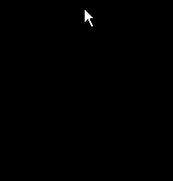
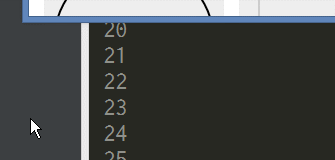
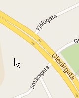
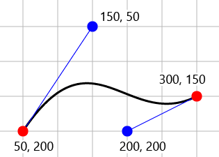
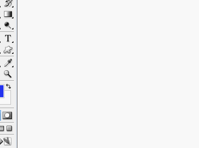

# DrGriffin

   

**Java8 is required**

DrGriffin controls a mouse and keyboard automatically for:

- Testing a GUI of desktop app, web app, operating system, etc.
- Making a demonstration movie clip that shows operating something
- etc.

It moves a mouse pointer, it pushes mouse buttons (e.g. click), it pushes keys of a keyboard, and it does mixed operation (drag, drag with pushing key, etc.), according to your request. You can control these speed and a path of mouse pointer motion, also.

 

When you test a GUI of your app, you may use a testing tool. DrGriffin will help that.  
For example, some testing tools for web apps fire events that are based on DOM elements to emulate user's operation. Therefore, those tools sometimes click an element that can't be clicked by user because it is positioned behind another element. Or those tools sometimes click a wrapper element that is not a wrapped element that has to be clicked.  
DrGriffin actually does the operation like a user do. It moves a mouse pointer onto the target point, and then it clicks there. That is, an element that can be clicked by user is clicked by DrGriffin. And the app has an experience that is same as that by user's operation.  
DrGriffin runs on the outside of web browsers or apps. It means that, for example, DrGriffin can drag and drop a file from a filer such as Windows explorer into another app. It can do a drag and drop action in an app, also.

DrGriffin moves a mouse pointer to a position you specified, as motion. That is, a mouse pointer is not put onto the position immediately, it gradually moves to the position at specific speed. (DrGriffin can also put it onto the position immediately.)

You can specify a curve as a path the mouse pointer follows. The curve is a [Bezier curve](https://en.wikipedia.org/wiki/B%C3%A9zier_curve) that is supported by many drawing apps such as Adobe Illustrator, HTML `canvas`, SVG, etc.

 

You can specify a "timing function" that indicates how to change the speed at which a mouse pointer is moving. It works same as that of [CSS animation](https://developer.mozilla.org/en/docs/Web/CSS/timing-function), [SVG animation](https://developer.mozilla.org/en-US/docs/Web/SVG/Attribute/keySplines), etc.

This following sample: gave DrGriffin these data that were picked up in a SVG formated image file, and then DrGriffin is drawing an image in a paint app.

## Command Line Tool

See [CLI.md](doc/CLI.md).

## Java

See [Java.md](doc/Java.md).

## Node.js

See [NodeJS.md](doc/NodeJS.md).
