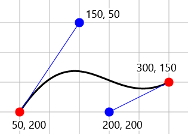
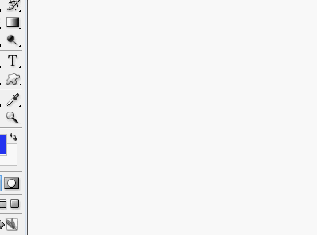
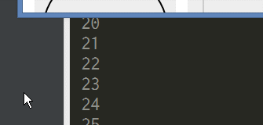

# DrGriffin - Java

## Setup

Add a path of `drgriffin/lib/DrGriffin.jar` file to a `classpath` of your project.  
For example:

- IntelliJ IDEA: File > Project Structure > Modules > Dependencies
- Eclipse: Properties of project > Java Build Path > Libraries
- Gradle: `dependencies` > `compile` configuration

Import `DrGriffin` class to your source code.

```java
import io.github.anseki.drgriffin.DrGriffin;
```

## Constructor

```java
DrGriffin([int fps])
```

Initialize DrGriffin and return an instance.

An optional `fps` is frame rate of the motion as a mouse pointer moving. This is a number of frames per second. The default value is `60`.

----
```java
DrGriffin(int delay, double dx, double dy[, int fps])
```

A start position of a mouse pointer in [`moveMouse`](#movemouse) method is current position. If optional `delay`, `dx` and `dy` are specified, the mouse pointer is put onto a position the `dx` and `dy` coordinates indicate, after `delay` milliseconds.  
This is used to put a mouse pointer onto a start position of the motion without calling [first `moveMouse`](#methods-movemouse-int-delay-double-dx-double-dy) method.  
The following 2 codes work same:

```java
DrGriffin drGriffin = new DrGriffin();
drGriffin.moveMouse(3000, 150, 100);
// Start...
```

```java
DrGriffin drGriffin = new DrGriffin(3000, 150, 100);
// Start...
```

## Methods

### `moveMouse`

```java
moveMouse(int delay, double dx, double dy,
    [ double c1x, double c1y, double c2x, double c2y, ]
    [ double speed, ]
    { String timing | double t1x, double t1y, double t2x, double t2y })
```

Move a mouse pointer from current position to a position the `dx` and `dy` coordinates indicate, after `delay` milliseconds. These coordinates are numbers of pixels on a screen.

(You can use [command line tool `pointer-xy`](CLI.md#pointer-xy) to get these coordinates easily.)

By default, a mouse pointer moves to the specific position as drawing a straight line. If optional `c1x`, `c1y`, `c2x` and `c2y` are specified, the mouse pointer follows a curve these indicate. The curve is a [Bezier curve](https://en.wikipedia.org/wiki/B%C3%A9zier_curve) that is supported by many drawing apps such as Adobe Illustrator, HTML `canvas`, SVG, etc.  
The `c1x` and `c1y` indicate a first control point of the curve. The `c2x` and `c2y` indicate a second control point of the curve.  
For example:

```java
DrGriffin drGriffin = new DrGriffin(500, 50, 200);
drGriffin.moveMouse(500, 300, 150, 150, 50, 200, 200, null);
```

 

If you use a drawing app to get the data of curves, "exporting to SVG format" is easy way. There are the texted path data of curves in the SVG.  
This following sample: gave DrGriffin these data that were picked up in a SVG formated image file, and then DrGriffin is drawing an image in a paint app.



You can specify an optional `timing` as a "timing function" that indicates how to change the speed at which a mouse pointer is moving. It works same as that of [CSS animation](https://developer.mozilla.org/en/docs/Web/CSS/timing-function), [SVG animation](https://developer.mozilla.org/en-US/docs/Web/SVG/Attribute/keySplines), etc.  
One of the following names of constant values (static fields) can be specified to `timing`. These values mean [keywords for common timing functions](https://developer.mozilla.org/en/docs/Web/CSS/timing-function#Keywords_for_common_timing-functions).

| Name | Keyword for timing function |
|--|--|
| `TF_LINEAR` | `linear` |
| `TF_EASE` (default) | `ease` |
| `TF_EASE_IN` | `ease-in` |
| `TF_EASE_IN_OUT` | `ease-in-out` |
| `TF_EASE_OUT` | `ease-out` |


All above reach the goal at same time (i.e. same values of `speed` argument).

For example:

```java
DrGriffin drGriffin = new DrGriffin();
drGriffin.moveMouse(1000, 600, 550, DrGriffin.TF_EASE_IN_OUT);
```

If `null` or `""` is specified to `timing`, a timing function that was specified last time is used. If it has never been specified before, `TF_EASE` is used.

If you want to use your custom timing function, specify `t1x`, `t1y`, `t2x` and `t2y` instead of `timing`. A Bezier curve these indicate is used as timing function. It works same as [`cubic-bezier()` of CSS](https://developer.mozilla.org/en/docs/Web/CSS/timing-function#The_cubic-bezier%28%29_class_of_timing-functions) and others. Therefore you can use many tools such as [Cubic Bezier](http://cubic-bezier.com/), [Ceaser - CSS Easing Animation Tool](http://matthewlein.com/ceaser/), etc.
The `t1x` and `t1y` indicate a first control point of the curve. The `t2x` and `t2y` indicate a second control point of the curve.  
Note that these values are limited to be within a range of `0` to `1`.

 

A mouse pointer gradually moves to the specific position at the speed that is specified by an optional `speed`. This is an average speed that specifies a number of pixels as the movement distance per millisecond.  
One of the following names of constant values (static fields) can be specified to `speed` instead of a number.

| Name | Speed |
|-|-|
| `SPEED_NORMAL` (default) | `0.3` |
| `SPEED_LOW1` | `0.1`, slower than `SPEED_NORMAL` |
| `SPEED_LOW2` | `0.05`, slower than `SPEED_LOW1` |
| `SPEED_HIGH1` | `0.5`, faster than `SPEED_NORMAL` |
| `SPEED_HIGH2` | `1.0`, faster than `SPEED_HIGH1` |

If `speed` is not specified, a value that was specified last time is used. If it has never been specified before, `SPEED_NORMAL` is used.

----
<a name="methods-movemouse-int-delay-double-dx-double-dy"></a>
```java
moveMouse(int delay, double dx, double dy)
```

Put a mouse pointer onto a position the `dx` and `dy` coordinates indicate, after `delay` milliseconds. That is, a mouse pointer moves to the specific position in a moment, after `delay` milliseconds.

### `pressButton`

```java
pressButton(int delay[, int button[, boolean andRelease]])
```

Press or release a mouse button, after `delay` milliseconds.  
A drag-and-drop action includes pressing a mouse button, moving a mouse pointer and releasing the button.


One of the following names of constant values (static fields) can be specified to `button`.

| Name | Button |
|---|---|
| `BUTTON_1` | Mouse Button1 |
| `BUTTON_2` | Mouse Button2 |
| `BUTTON_3` | Mouse Button3 |
| `BUTTON_NONE` | No Mouse Button |

For example, press a mouse button 1:

```java
drGriffin.pressButton(500, DrGriffin.BUTTON_1);
```

A mouse button the `button` indicates is pressed after `delay` milliseconds. If `BUTTON_NONE` is specified to `button` or `button` is not specified, the current pressed button is released after `delay` milliseconds. A current pressed button is automatically released before a button that is not current pressed button is pressed.  

For example, release the current pressed mouse button:

```java
drGriffin.pressButton(500);
```

If `true` is specified to `andRelease`, a specified mouse button is pressed after `delay` milliseconds, and it is released immediately. That is, this action is "click".

For example, press a mouse button 1 and release it (i.e. "click"):

```java
drGriffin.pressButton(500, DrGriffin.BUTTON_1, true);
```

For example, press a mouse button 1, release it and press a mouse button 3:

```java
drGriffin.pressButton(500, DrGriffin.BUTTON_1);
drGriffin.pressButton(500, DrGriffin.BUTTON_3);
```

For example:

```java
DrGriffin drGriffin = new DrGriffin(1000, 600, 550);
drGriffin.pressButton(0, DrGriffin.BUTTON_1); // Drag.
drGriffin.moveMouse(0, 800, 600, null); // Left button is being pressed yet.
drGriffin.pressButton(0, DrGriffin.BUTTON_3, true);
// Left button is automatically released, and right click.
```

### `pressKey`

```java
pressKey(int delay[, int key[, boolean andRelease[, boolean release]]])
```

Press or release a key of a keyboard, after `delay` milliseconds.



One of the following names of constant values (static fields) can be specified to `key`.

| Name | Key |
|-|-|
| `KEY_NONE` | No Key |

(See [KeyCode.md](KeyCode.md) for other keys.)

A key the `key` indicate is pressed after `delay` milliseconds. If `KEY_NONE` is specified to `key` or `key` is not specified, the key that was pressed last time is released after `delay` milliseconds. If `true` is specified to `release`, the specified key is released after `delay` milliseconds. The pressed keys are not released even if another key is pressed until the key is released deliberately.  
If `true` is specified to `andRelease`, a specified key is pressed after `delay` milliseconds, and the key is released immediately. That is, this action is "type".

For example, type "Hello":

```java
DrGriffin drGriffin = new DrGriffin();
drGriffin.pressKey(100, DrGriffin.VK_SHIFT);
drGriffin.pressKey(100, DrGriffin.VK_H, true);            // Capital `H`
drGriffin.pressKey(100, DrGriffin.VK_SHIFT, false, true);
drGriffin.pressKey(100, DrGriffin.VK_E, true);            // `e`
drGriffin.pressKey(100, DrGriffin.VK_L, true);            // `l`
drGriffin.pressKey(100, DrGriffin.VK_L, true);            // `l`
drGriffin.pressKey(100, DrGriffin.VK_O, true);            // `o`
```

## See Also

You can use [command line tool `pointer-xy`](CLI.md#pointer-xy) to get coordinates of position of a mouse pointer easily.
